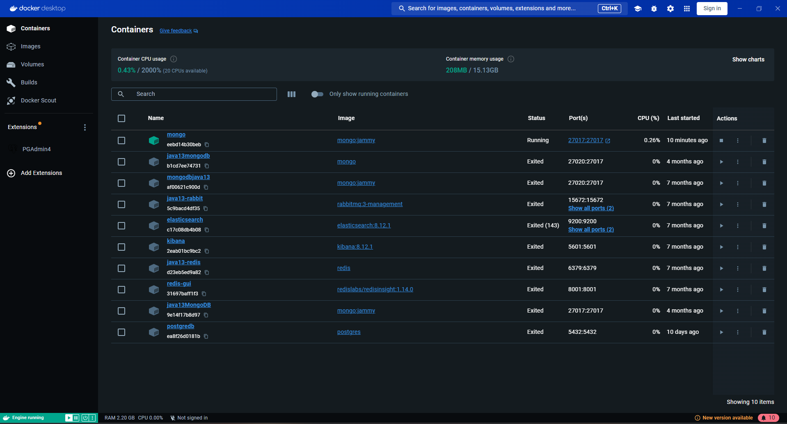
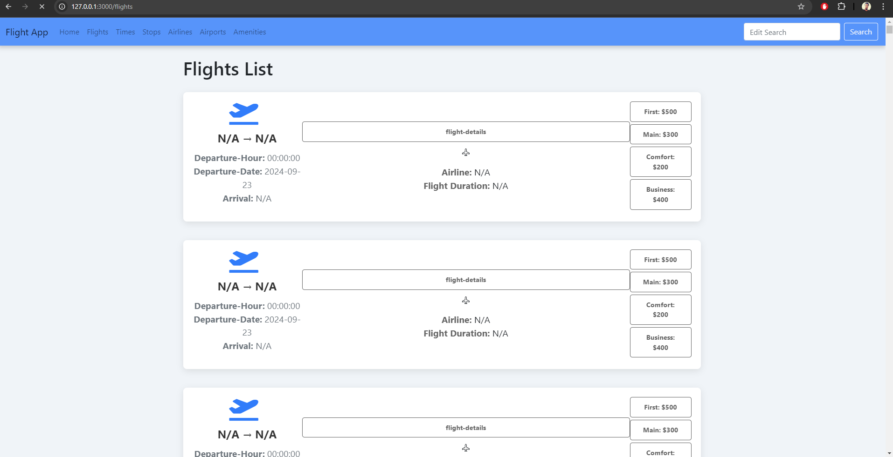
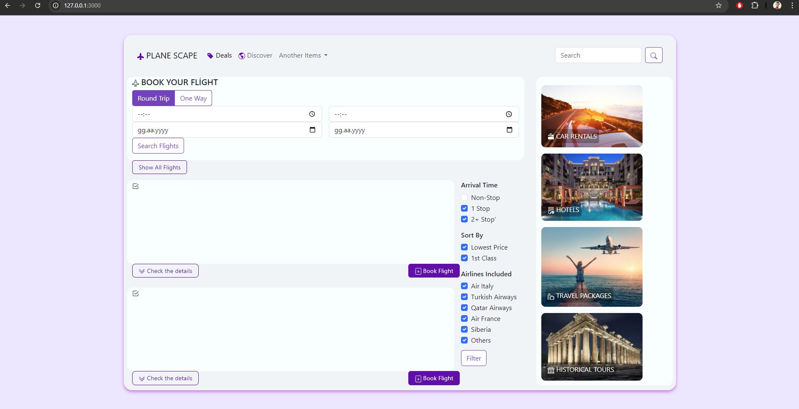
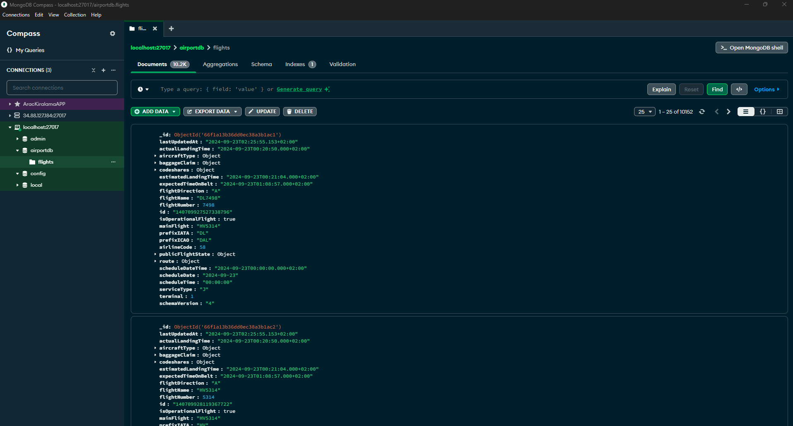
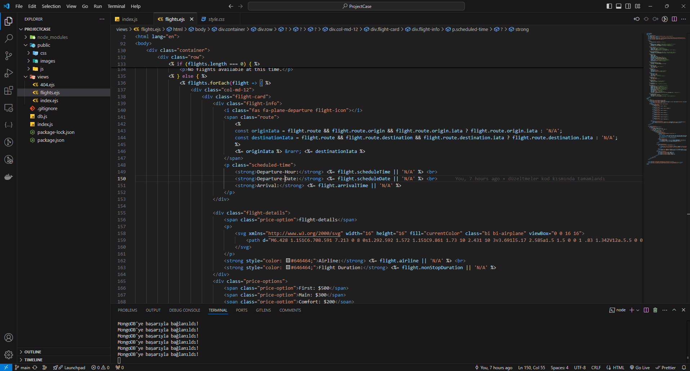

# Flight Reservation Application

## Proje Açıklaması
Bu uygulama, uçuş rezervasyonu yapmaya yönelik bir web uygulamasıdır. Kullanıcılar, mevcut uçuşları görüntüleyebilir, tarihlere ve saatlere göre filtreleme yapabilir ve rezervasyon yapabilirler.

## Minimum Gereksinimler
- Node.js v14 veya üstü
- MongoDB v4.0 veya üstü
- Bir web tarayıcısı (Chrome, Firefox vb.)

## Ön Koşullar
1. **Node.js** ve **MongoDB**'yi sisteminize kurun.
2. Proje klasörüne gidin ve gerekli bağımlılıkları yüklemek için şu komutu çalıştırın:
   ```bash
   npm install
## Uygulamayı başlatmak için
- bash
- Kodu kopyala
- npm start
- Uygulama varsayılan olarak http://localhost:3000 adresinde çalışacaktır.

## Kullanılan Teknolojiler
- **Node.js**: Sunucu tarafı uygulama geliştirmek için.
- **Express**: Node.js için web uygulama çatısı.
- **MongoDB**: NoSQL veritabanı yönetimi.
- **EJS**: Şablon motoru, dinamik HTML içerik oluşturmak için.
- **Axios**: HTTP istekleri yapmak için.
- **Bootstrap**: Responsive tasarım için CSS framework'u.
- **Nodemon**: Geliştirme sırasında otomatik yeniden başlatma için.

## Uygulama görüntüleri ve videoları
## Ekran Görüntüleri
- Ekran görüntüleri Ss klasörü içerisindedir.








